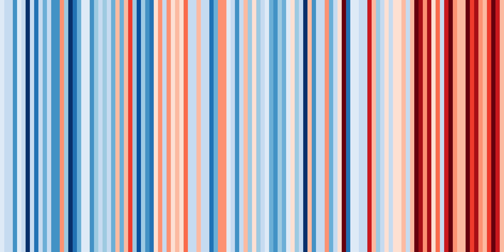
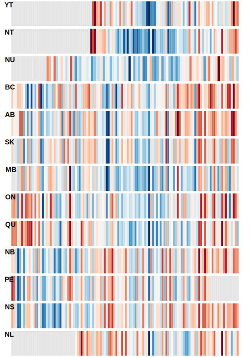

# Climate stripes for Canada

In 2018, Ed Hawkins, a climate scientist from the UK, introduced Warming Stripes as a way to visualise climate change from meteorological data. Just a few weeks ago, Ed and colleagues launched the the [#showyourstripes website](https://showyourstripes.info), which makes it really easy to generate a warming stripes image for locations around the globe. Unfortunately for Canada, the only dataset available on the site is the average annual temperature series for Canada from the Berkely Earth data set.

Let's create resources to visualise Canada's changing climate using data from the Adjusted and Homogenised Canadian Climate Data (AHCCD) set and allow people to easily generate climate stripes for their local region.

## Team

Gavin Simpson & Kimberly Hinz, University of Regina

## Our submission

Additional images are in the [plots](./plots/) folder
